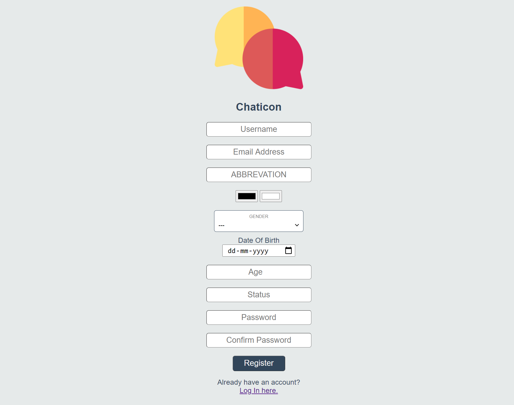
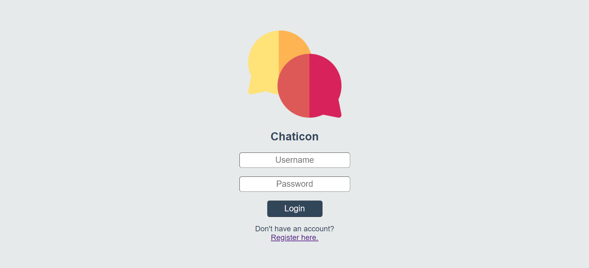
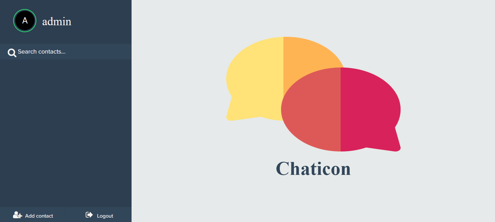
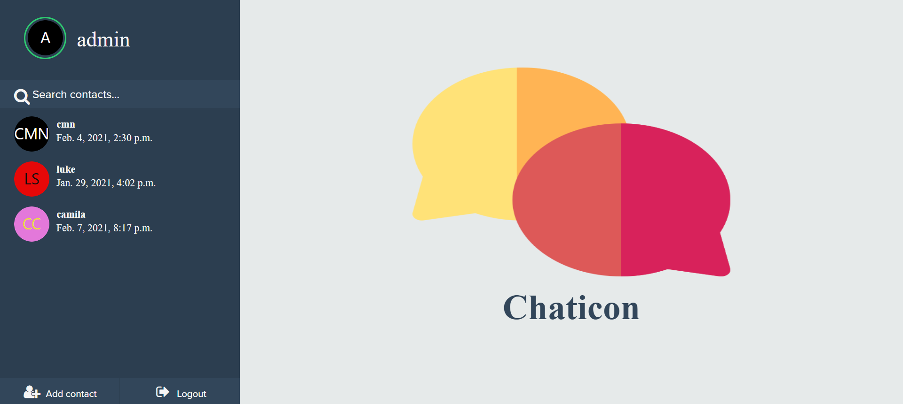
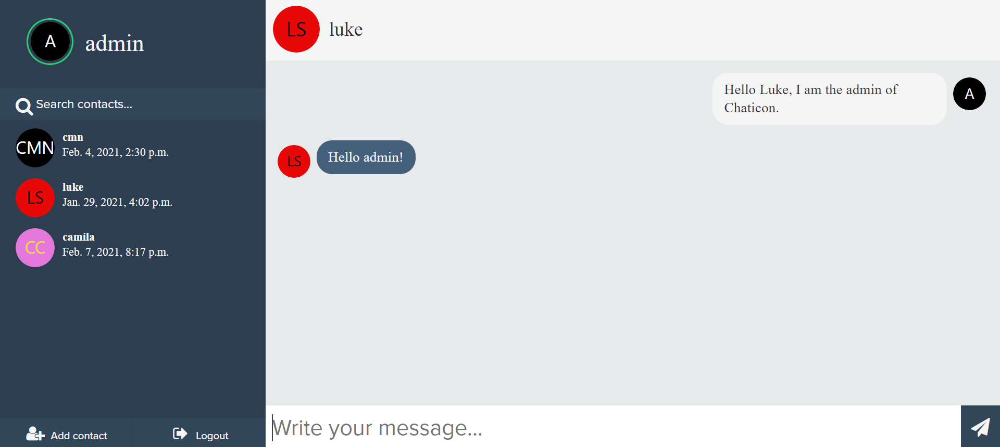
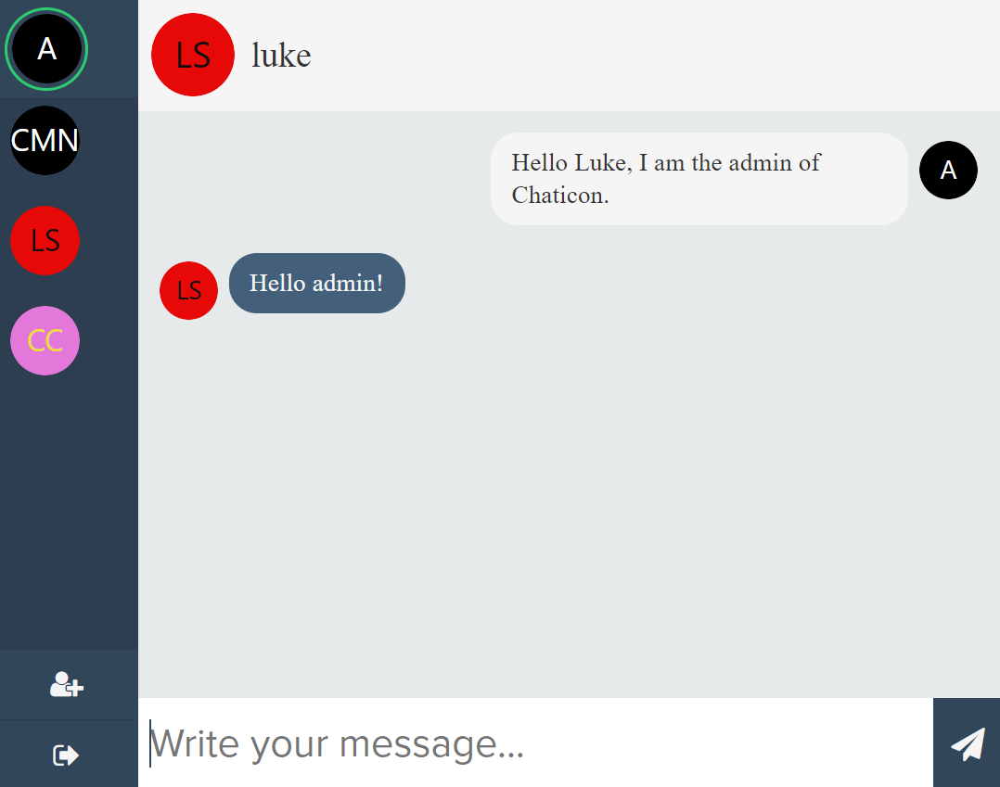
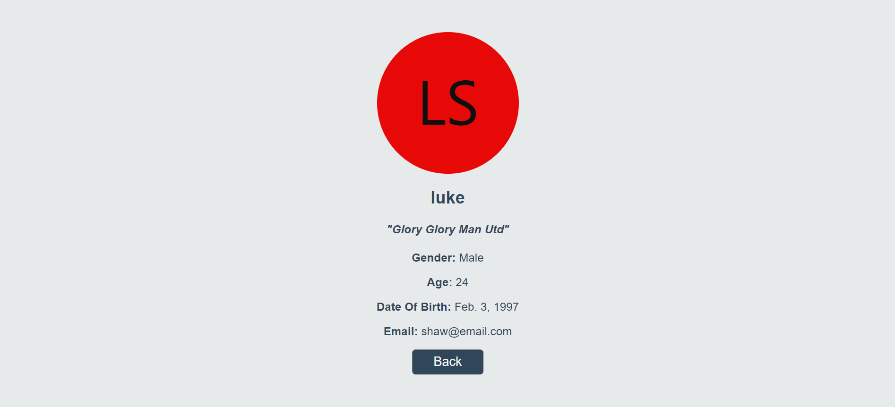
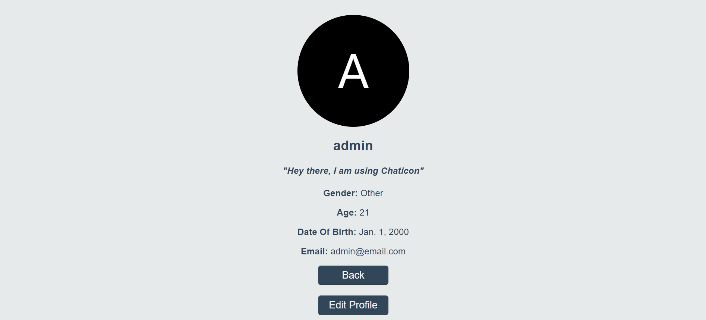
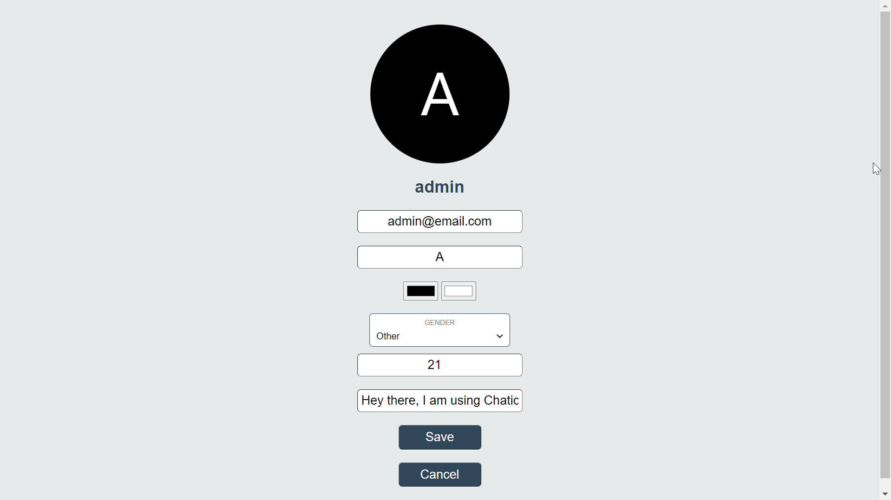

# Project 5: Capstone | edX | Harvard | CS50 - Web Programming with Python and JavaScript
##### A Chatting web application that uses Django Channels and WebScokets

This web application has been developed using the Django Framework. This is a real time chatting website named **"_Chaticon_"**. To make this chatting application a work in real time, i.e user chatting with each other can send and receive messages live, without retrieving data from a database. This is done so by using the Django Channels and Django Web Sockets which is a concept that hasn't been used in any of the previous projects.

## Getting Started

#### Activating the available Virtual Environment
1. Open CMD
2. Change the directory to the location of the folder
```bash
cd (location of the folder)
```
3. Activate the virtual environment named _**chat-env**_
```bash
chat-env\Scripts\activate   --For Windows
chat-env/bin/activate   --For MacOS
```

<br>

#### Running the application
1. To run the application, type the following command:
```bash
python manage.py runserver
```
2. A local server will be created and the link for which will be displayed in the CMD.
3. Open the link in a browser and voila!! Your project is up and running.

<br>

#### Using the application
1. You are most welcome to create a new account using the web application.
2. On logging in, you will be presented with a button on the bottom left which allows users to add new contacts to there list.
3. A user can add other available contacts which will then be displayed of the left of the screen.
4. On clicking a user, a chat terminal will appear on the right hand side.
5. Your precious conversations (if any) shall appear here and you can start sending and receiving text messages in real time!

<br>  


## About the application

#### Registration Page: (/register)
The **Registration Page** helps a new user to create a account so that the user can use this chatting website. If the user already has an account, he can directly login.  
  

While filling the form, the form requires an abbreviation for the user account so as to generate a _Letter Avatar_ for the user. The user can edit and change the colors of the letter avatar as per their preference. The preview of the changes in the letter avatar will be reflected at the top.
  
<br>

#### Login Page: (/login)
The **Login Page** helps the user to login in so that the user can use this chatting website. If the user does not have a account, he can create one using the register option.
  
<br>

#### Index Page: (/)
The **Index Page** or the **Home Page** (default route), is where users can chat with others. This page can only be accessed by a logged in user.
  

This page has displays the name of the logged in user in the top half of the side panel. On clicking of the contact icon or name, the user can view their own profile and can edit the same further if they want to.

Users can search through their contact list using the search bar provided in the side panel.  

There are 2 buttons at the bottom of the side panel, _"Add Contact"_ and _"Logout"_.

The Add Contact button takes the user to the Add Contact Page (/addcontact) while the Logout button logs the user out and goes back to the Login Page (/login)

Also in the side panel, the user will be able to their contacts. Basic information like the contact username, contact avatar and the last log in time of the users is visible in the side panel itself.
  

On clicking on any of these contacts, the corresponding chat conversation appears on the right side of the screen. Here the user can read the previous messages as well as can send and receive new messages in real time. The messages by the logged in user appears on the right while the messages received is displayed on the left side of the conversation.
  

This application is a mobile responsive application. The same can be seen evidently in the screen shot of the Index Page when the browser is resized. In this resized window, only the user avatars can be seen in the side panel.
  
<br>

#### Add Contact Page: (/addcontact)
The **Add Contact Page** helps the user to add new contacts to his chatting application. This page can only be accessed by a logged in user.  

This webpage displays all the users that are present on the Chaticon Platform. The user can select the desired users that they want to add and then click on the _"Add Contacts"_ button. On doing so, the user is prompted with a confirmation alert and is then taken back to the home page where the newly added contacts can be accessed from the side panel.
  
<br>

#### Profile Page: (/profile/<_username_>)
The **Profile Page** displays information of a particular user. This page can only be accessed by a logged in user.  

This page displays basic information of a user. Information such as user avatar, username, status, gender, age, date of birth and email can be seen on this page. The _"Back"_ button takes the user back to the home page.
  

If a user is viewing his own profile page, then an addition button _"Edit Profile"_ can be clicked which will take the user to the Edit Profile Page (/edit) wherein the user can change their basic information.
  
<br>  

#### Edit Page: (/edit)
The **Edit Page** allows the user to edit the basic information of their Chaticon account. This page can only be accessed by a logged in user.  

The user can change their email-id, age, status and their character avatar.
  
<br>  


## Author 
---
This project has been made by me, Chaitanya Malani and was completed on 10th February 2021 for submission for [Project 5: Capstone](https://cs50.harvard.edu/web/2020/projects/final/capstone/) of the edX Course: [CS50's Web Programming with Python and JavaScript](https://www.edx.org/course/cs50s-web-programming-with-python-and-javascript).

Demonstration of this project can be viewed on [YouTube](https://youtu.be/c2NIjIZjGVQ)

I am an aspiring software engineer who is currently studying Computer Science in Mumbai, India. I love to code and explore various fields within computers. Also I am a very big football enthusiast and I love supporting Manchester United F.C.

Follow me on  
Instagram: https://www.instagram.com/itsme.cmn22/  
Twitter: https://twitter.com/ChaitanyaMalani
